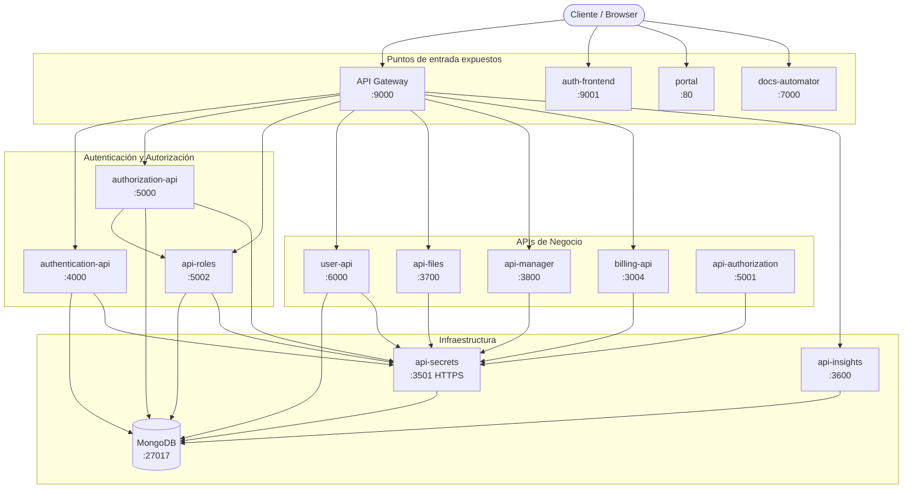
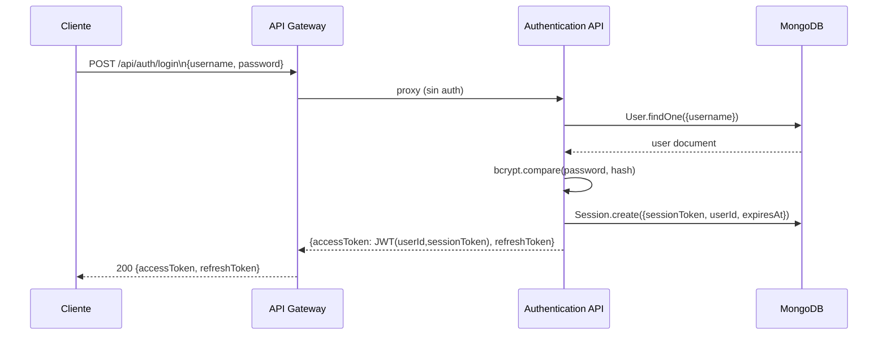
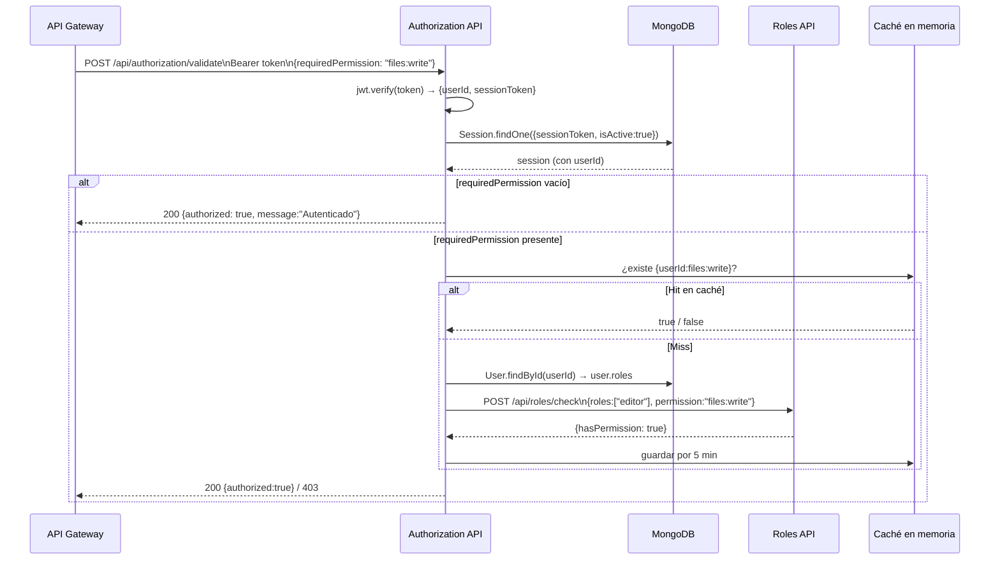
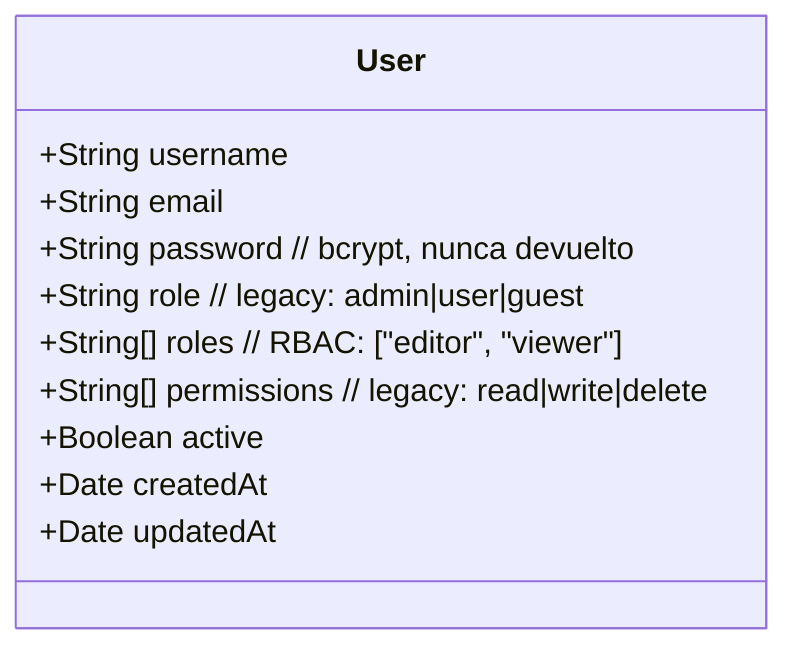
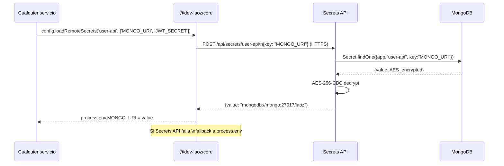
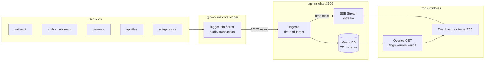
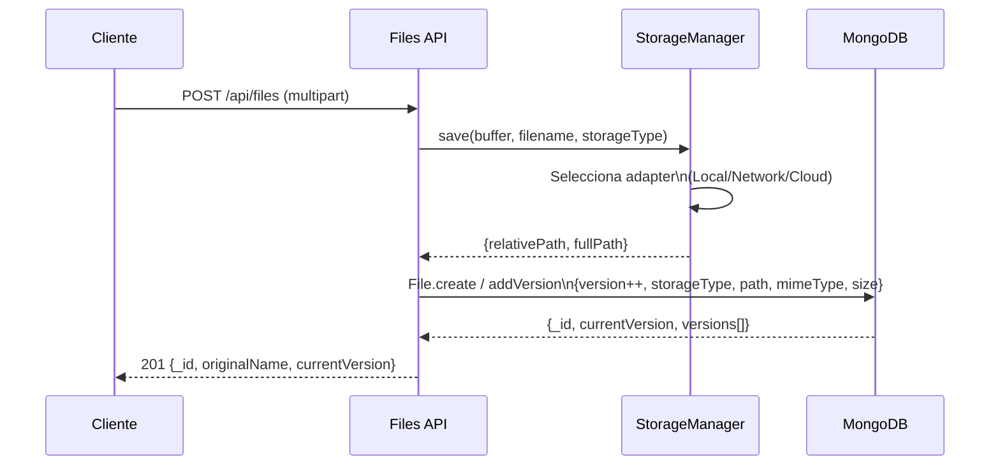
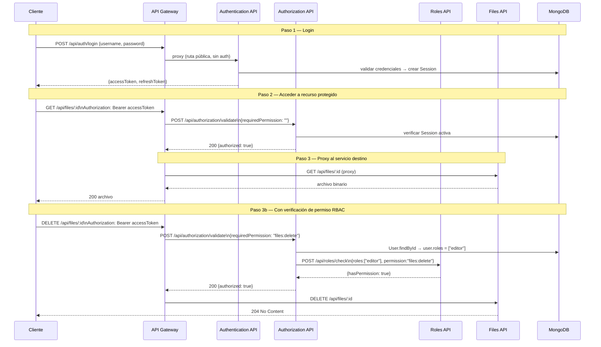
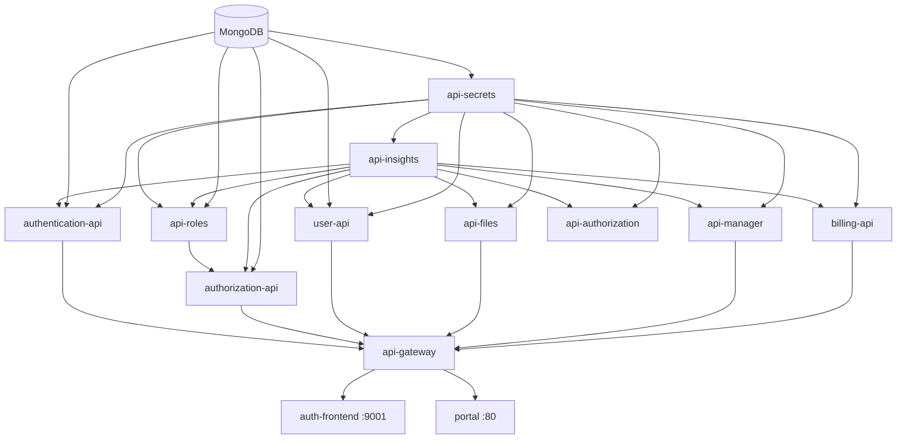

# Dev Laoz — Arquitectura del Ecosistema

## Visión general

El ecosistema Dev Laoz es una plataforma de microservicios en Node.js/Express orquestados con Docker Compose. Todos los servicios backend comparten la librería interna `@dev-laoz/core` (en `dev-laoz-config-loader`) que provee logging, carga de secretos, autenticación y rate-limiting transversales.



---

## Servicios

### API Gateway — puerto 9000

**Repositorio:** `dev-laoz-api-gateway`

Único punto de entrada externo. Responsabilidades:

- Proxy inverso a todos los microservicios (config en `src/config/services.json`)
- Valida autenticación llamando a Authorization API para rutas protegidas
- Rate limiting y circuit breaker por defecto
- SSE bypass directo para `/api/insights/stream`

**No exponer** ningún servicio backend directamente en producción; todo tráfico debe pasar por aquí.

---

### Authentication API — puerto 4000

**Repositorio:** `dev-laoz-authentication-api`

Responsable exclusivo de **emitir tokens JWT**.

| Endpoint | Método | Auth | Descripción |
| --- | --- | --- | --- |
| `/api/auth/login` | POST | No | Login → devuelve `accessToken` (1h) + `refreshToken` (7d) |
| `/api/auth/refresh` | POST | No | Renueva access token con refresh token |
| `/api/auth/logout` | POST | Sí | Invalida sesión en BD |
| `/api/auth/verify` | GET | Sí | Verifica validez del token |
| `/api/auth/health` | GET | No | Healthcheck |

**Flujo de login:**



El JWT **no contiene roles ni permisos** — solo `{ userId, sessionToken }`. Los permisos se resuelven en Authorization API.

---

### Authorization API — puerto 5000

**Repositorio:** `dev-laoz-authorization-api`

Valida tokens y **verifica permisos RBAC** consultando Roles API.

| Endpoint | Método | Auth | Descripción |
| --- | --- | --- | --- |
| `/api/authorization/validate` | POST | Sí (Bearer) | Valida token y opcionalmente verifica permiso |
| `/api/authorization/health` | GET | No | Healthcheck |

**Request body:**

```json
{ "requiredPermission": "files:write" }
```

- Si `requiredPermission` está vacío → solo valida autenticación (200 OK)
- Si está presente → consulta api-roles con los roles del usuario

**Flujo RBAC:**



---

### Roles & Permissions API — puerto 5002

**Repositorio:** `dev-laoz-api-roles`

Fuente de verdad para **roles y sus permisos**. Los permisos siguen el formato `resource:action`.

**Roles predeterminados (del sistema):**

| Rol | Permisos |
| --- | --- |
| `admin` | Todo (`users:*`, `roles:*`, `files:*`, `secrets:*`, `insights:*`, `billing:*`) |
| `editor` | `files:read/write/delete`, `insights:read` |
| `viewer` | `files:read`, `insights:read` |
| `user` | `files:read` |

| Endpoint | Método | Auth | Descripción |
| --- | --- | --- | --- |
| `/api/roles` | GET | Sí | Lista todos los roles |
| `/api/roles` | POST | Sí | Crea rol personalizado |
| `/api/roles/:id` | GET/PUT/DELETE | Sí | Gestión por ID |
| `/api/roles/name/:name` | GET | Sí | Obtiene rol por nombre |
| `/api/roles/check` | POST | No | Verifica si roles[] tienen un permiso (uso interno) |

---

### User API — puerto 6000

**Repositorio:** `dev-laoz-api-user`

CRUD completo de usuarios. **Registro es público** (POST `/api/user`). El resto requiere autenticación.

| Endpoint | Método | Auth | Descripción |
| --- | --- | --- | --- |
| `/api/user` | GET | Sí | Lista usuarios |
| `/api/user` | POST | No | Registra nuevo usuario |
| `/api/user/:id` | GET | Sí | Obtiene usuario por ID |
| `/api/user/:id` | PUT | Sí | Actualiza usuario |
| `/api/user/:id` | DELETE | Sí | Elimina usuario |

**Modelo User:**



Para asignar roles RBAC a un usuario, usar `PUT /api/user/:id` con `{ "roles": ["editor"] }`.

---

### Secrets API — puerto 3501 (HTTPS)

**Repositorio:** `dev-laoz-api-secrets`

Almacena y sirve **secretos cifrados** con AES-256-CBC. Solo accesible desde IPs internas de la red Docker (`laoz-net`).

| Endpoint | Método | Restricción | Descripción |
| --- | --- | --- | --- |
| `/api/secrets` | POST | IP interna | Crea/actualiza un secreto |
| `/api/secrets/:app` | POST | IP interna | Obtiene secreto por app y key |
| `/api/health` | GET | Ninguna | Healthcheck |

**Cómo lo usan los demás servicios:**



**Variable de entorno requerida:** `ENCRYPTION_KEY` — exactamente 32 caracteres (AES-256-CBC)

---

### Insights API — puerto 3600

**Repositorio:** `dev-laoz-api-insights`

Centraliza **logs, auditoría y métricas HTTP** de todos los servicios. Los datos expiran por TTL (7/90/3 días).

**Ingesta (sin auth — fire-and-forget):**

| Endpoint | Método | Descripción |
| --- | --- | --- |
| `/api/insights/log` | POST | Log del sistema (info/warn/error/debug) |
| `/api/insights/audit` | POST | Evento de auditoría (actor, acción, resultado) |
| `/api/insights/transaction` | POST | Transacción HTTP (path, método, status, duración) |

**Consulta (requiere auth):**

| Endpoint | Método | Filtros disponibles |
| --- | --- | --- |
| `/api/insights/logs` | GET | `service`, `level`, `from`, `to`, `limit`, `skip` |
| `/api/insights/errors` | GET | `service`, `from`, `to`, `limit` |
| `/api/insights/audit` | GET | `actor`, `action`, `outcome`, `from`, `to` |
| `/api/insights/transactions` | GET | `service`, `method`, `statusCode`, `minDuration` |
| `/api/insights/stream` | GET (SSE) | Stream en tiempo real — requiere auth |

**Pipeline de observabilidad:**



**Cómo lo usan los demás servicios:**

```js
const { logger } = require('@dev-laoz/core');
logger.info('mensaje', { metadata });
logger.error('error', err.stack, { contexto });
logger.audit('system', 'USER_CREATED', userId, 'SUCCESS', {});
logger.transaction('/api/files', 'POST', 201, 45);
```

Las llamadas son fire-and-forget (no bloquean el servicio si Insights falla).

---

### Files API — puerto 3700

**Repositorio:** `dev-laoz-api-files`

Gestión de archivos con **versionado** y soporte multi-almacenamiento (Local / Network / Cloud).

| Endpoint | Método | Auth | Descripción |
| --- | --- | --- | --- |
| `/api/files` | POST | Sí | Sube archivo (multipart) |
| `/api/files/content` | POST | Sí | Guarda contenido de texto |
| `/api/files/:id` | GET | Sí | Descarga versión actual |
| `/api/files/:id/versions` | GET | Sí | Lista versiones |
| `/api/files/:id/versions/:vId` | GET | Sí | Descarga versión específica |
| `/api/files/:id/move` | PUT | Sí | Mueve entre tipos de almacenamiento |
| `/api/files/:id/copy` | POST | Sí | Copia archivo |

**Flujo de subida con versionado:**



**Modelo File:**

- `versions[]` — historial completo de versiones con storageType, path, mimeType, size
- `deleted` — borrado lógico (soft delete)
- `tags[]` — etiquetas para clasificación

---

### Api Manager — puerto 3800

**Repositorio:** `dev-laoz-api-manager`

Control de **contenedores Docker y repositorios Git** (requiere acceso a `/var/run/docker.sock`).

| Endpoint | Método | Auth | Descripción |
| --- | --- | --- | --- |
| `/api/manager/containers` | GET | Sí | Lista contenedores |
| `/api/manager/containers/:id/start` | POST | Sí | Inicia contenedor |
| `/api/manager/containers/:id/stop` | POST | Sí | Detiene contenedor |
| `/api/manager/containers/:id/logs` | GET | Sí | Logs del contenedor |
| `/api/manager/git/clone` | POST | Sí | Clona repositorio |
| `/api/manager/git/status/:folder` | GET | Sí | Estado del repo |
| `/api/manager/git/pull/:folder` | POST | Sí | Pull del repo |

---

### Billing API — puerto 3004

**Repositorio:** `dev-laoz-billing-api`

Gestión de **pagos y suscripciones** (usa Sequelize/SQL internamente).

| Endpoint | Método | Auth | Descripción |
| --- | --- | --- | --- |
| `/api/billing/payments/cliente/:id` | GET | Sí | Historial de pagos |
| `/api/billing/payments` | POST | Sí | Registra pago |
| `/api/billing/payments/estado/:id` | GET | Sí | Estado de cuenta |
| `/api/billing/payments/suscripcion` | POST | Sí | Crea/actualiza suscripción |

---

## Librería compartida `@dev-laoz/core`

**Repositorio:** `dev-laoz-config-loader`
**Referenciado como:** `"@dev-laoz/core": "file:../dev-laoz-config-loader"`

```mermaid
flowchart LR
    subgraph CORE ["@dev-laoz/core (librería interna)"]
        C[config\nloadRemoteSecrets]
        L[logger\ninfo/error/audit/transaction]
        AM[authMiddleware]
        RL[rateLimitMiddleware]
        SW[createSwaggerDocs]
    end

    subgraph Consume
        AT[authentication-api]
        AZ[authorization-api]
        R[api-roles]
        U[user-api]
        AF[api-files]
        AM2[api-manager]
        B[billing-api]
        I[api-insights]
        GW[api-gateway]
    end

    Consume -->|require('@dev-laoz/core')| CORE
    C -->|HTTPS| S[api-secrets :3501]
    L -->|HTTP async| INS[api-insights :3600]
    AM -->|HTTP| AZ2[authorization-api :5000]
```

| Export | Descripción |
| --- | --- |
| `config` | `loadRemoteSecrets(appName, keys[])` — carga secretos desde Secrets API con fallback a env |
| `logger` | `info/error/audit/transaction` — fire-and-forget a Insights API |
| `authMiddleware` | Valida Bearer JWT delegando a Authorization API |
| `rateLimitMiddleware` | Rate limiting (configurable con `RATE_LIMIT_MAX`) |
| `createSwaggerDocs` | Setup de Swagger UI en `/api-docs` |

**Variables de entorno que consume:**

```
SECRETS_API_URL       = https://api-secrets:3501/api/secrets
AUTHORIZATION_API_URL = http://authorization-api:5000/api/authorization/validate
ROLES_API_URL         = http://api-roles:5002/api/roles/check
INSIGHTS_HOST         = api-insights
INSIGHTS_PORT         = 3600
RATE_LIMIT_MAX        = 100
```

---

## Flujo de autenticación completo



---

## Dependencias entre servicios (orden de arranque)



---

## Puertos expuestos (producción)

| Puerto | Servicio | Descripción |
| --- | --- | --- |
| **80** | portal | Frontend principal |
| **9000** | api-gateway | API pública |
| **9001** | auth-frontend | Frontend de autenticación |
| **7000** | docs-automator | Generador de documentación |

Todos los demás servicios están en la red interna `laoz-net` y **no son accesibles** desde el exterior.

---

## Levantar el stack

```bash
# Primera vez: construir imágenes
cd devops-laoz-infra
docker compose -f docker-compose.yml build --parallel

# Levantar en background
docker compose -f docker-compose.yml up -d

# Ver estado
docker compose -f docker-compose.yml ps

# Logs de un servicio
docker compose -f docker-compose.yml logs -f authorization-api

# Detener todo
docker compose -f docker-compose.yml down
```

> **Nota:** El override `docker-compose.override.yml` expone puertos internos para desarrollo local. No usarlo en producción.

---

## Variables de entorno requeridas (`.env`)

```
JWT_SECRET          # Mínimo 32 chars, base64 recomendado
ENCRYPTION_KEY      # Exactamente 32 chars, para AES-256-CBC en api-secrets
MONGO_URI           # mongodb://mongo:27017/laoz
SECRETS_API_URL     # https://api-secrets:3501/api/secrets
AUTHORIZATION_API_URL # http://authorization-api:5000/api/authorization/validate
ROLES_API_URL       # http://api-roles:5002/api/roles/check
INSIGHTS_HOST       # api-insights
INSIGHTS_PORT       # 3600
RATE_LIMIT_MAX      # 100
CORS_ORIGIN         # http://localhost:80
```
