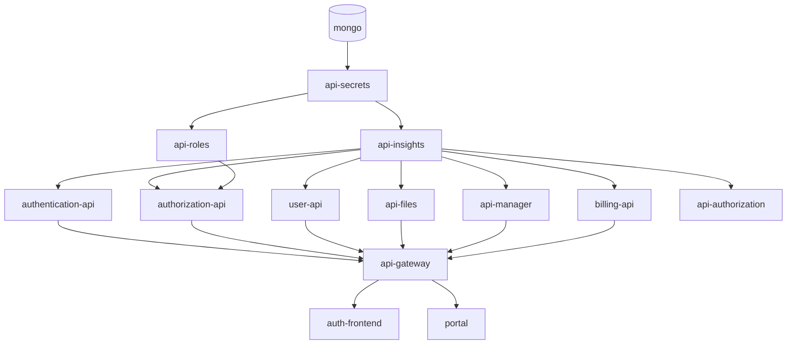

# Dev Laoz — Infraestructura Docker

Orquestación Docker Compose del ecosistema completo de microservicios Dev Laoz. Este directorio contiene la configuración de todos los servicios, variables de entorno y herramientas para levantar la plataforma completa en un solo comando.

Para la documentación detallada de la arquitectura ver [ARCHITECTURE.md](ARCHITECTURE.md).

## Servicios incluidos

| Servicio | Puerto interno | Puerto externo | Descripción |
|---|---|---|---|
| `mongo` | 27017 | — | Base de datos MongoDB 7 |
| `api-secrets` | 3501 (HTTPS) | — | Gestión de secretos cifrados |
| `api-insights` | 3600 | — | Observabilidad y logs |
| `api-roles` | 5002 | — | Roles y permisos RBAC |
| `authorization-api` | 5000 | — | Validación de tokens y permisos |
| `authentication-api` | 4000 | — | Emisión de tokens JWT |
| `api-authorization` | 5001 | — | Autorización de recursos |
| `user-api` | 6000 | — | CRUD de usuarios |
| `api-files` | 3700 | — | Gestión de archivos versionados |
| `api-manager` | 3800 | — | Control de Docker y Git |
| `billing-api` | 3004 | — | Pagos y suscripciones |
| `api-gateway` | 3002 | **9000** | Punto de entrada externo |
| `auth-frontend` | 80 | **9001** | Frontend de autenticación |
| `portal` | 80 | **80** | Portal principal |
| `docs-automator` | 7000 | **7000** | Generador de documentación |

## Cadena de dependencias



## Prerrequisitos

- **Docker Desktop** 24+ con Docker Compose V2
- Al menos **4 GB de RAM** disponibles para Docker
- Puertos `80`, `9000`, `9001`, `7000` libres en el host

## Configuración inicial

```bash
# 1. Clonar / ubicarse en el directorio de infra
cd devops-laoz-infra

# 2. Crear archivo de variables de entorno
cp .env.example .env   # Si existe, o crear manualmente

# 3. Editar .env con valores reales (ver tabla de variables)
```

## Variables de entorno requeridas (.env)

| Variable | Descripción | Ejemplo |
|---|---|---|
| `JWT_SECRET` | Clave para firmar JWT (mín. 32 chars) | `wY0KVH00xhMbpTDm8jv2...` |
| `ENCRYPTION_KEY` | Clave AES-256-CBC para api-secrets (**exactamente 32 chars**) | `UrCwMejRI4VWBiquQfpx19yb0OoLFZS7` |
| `MONGO_URI` | URI de MongoDB | `mongodb://mongo:27017/laoz` |
| `SECRETS_API_URL` | URL interna de api-secrets | `https://api-secrets:3501/api/secrets` |
| `AUTHORIZATION_API_URL` | URL interna de authorization-api | `http://authorization-api:5000/api/authorization/validate` |
| `ROLES_API_URL` | URL interna de api-roles | `http://api-roles:5002/api/roles/check` |
| `INSIGHTS_HOST` | Host de api-insights | `api-insights` |
| `INSIGHTS_PORT` | Puerto de api-insights | `3600` |
| `RATE_LIMIT_MAX` | Límite de requests por ventana | `100` |
| `CORS_ORIGIN` | Origen permitido en CORS | `http://localhost:80` |
| `API_VERSION` | Versión de la API | `1.0.0` |

## Comandos principales

### Construir imágenes

```bash
# Construir todos los servicios en paralelo
docker compose -f docker-compose.yml build --parallel

# Construir solo un servicio
docker compose -f docker-compose.yml build api-roles
```

### Levantar el stack

```bash
# Producción (solo docker-compose.yml)
docker compose -f docker-compose.yml up -d

# Desarrollo (con puertos expuestos y hot-reload via override)
docker compose up -d
```

### Verificar estado

```bash
docker compose -f docker-compose.yml ps
docker compose -f docker-compose.yml logs -f api-roles
docker compose -f docker-compose.yml logs -f --tail=50 authorization-api
```

### Detener el stack

```bash
# Detener sin borrar datos
docker compose -f docker-compose.yml down

# Detener y borrar volúmenes (borra MongoDB)
docker compose -f docker-compose.yml down -v
```

### Reconstruir un servicio tras cambios

```bash
docker compose -f docker-compose.yml build api-roles authorization-api
docker compose -f docker-compose.yml up -d api-roles authorization-api
```

## Modo desarrollo (docker-compose.override.yml)

El archivo `docker-compose.override.yml` (cargado automáticamente con `docker compose up`) expone los puertos internos de cada servicio para debugging y activa hot-reload con nodemon.

**No usar en producción** — expone puertos que deben permanecer internos.

```bash
# Ver puertos expuestos en modo dev
docker compose ps
```

## Healthchecks

Los siguientes servicios tienen healthcheck configurado y los demás esperan a que estén `healthy`:

| Servicio | Endpoint de healthcheck |
|---|---|
| `mongo` | `mongosh --eval "db.adminCommand('ping')"` |
| `api-secrets` | `GET /api/health` (HTTPS) |
| `authentication-api` | `GET /api/auth/health` |
| `authorization-api` | `GET /api/authorization/health` |

## Acceso a Swagger UI por servicio

Una vez levantado el stack, cada servicio expone su documentación Swagger (solo accesible desde la red interna o en modo dev con puerto expuesto):

| Servicio | URL Swagger (modo dev) |
|---|---|
| authentication-api | http://localhost:4000/api-docs |
| authorization-api | http://localhost:5000/api-docs |
| api-roles | http://localhost:5002/api-docs |
| user-api | http://localhost:6000/api-docs |
| api-secrets | https://localhost:3501/api-docs |
| api-insights | http://localhost:3600/api-docs |
| api-files | http://localhost:3700/api-docs |
| api-manager | http://localhost:3800/api-docs |
| billing-api | http://localhost:3004/api-docs |

## Estructura de archivos

```
devops-laoz-infra/
├── docker-compose.yml          # Stack de producción
├── docker-compose.override.yml # Overrides de desarrollo
├── .env                        # Variables de entorno (no commitear)
├── .env.example                # Plantilla de variables
├── ARCHITECTURE.md             # Documentación detallada de arquitectura
└── README.md                   # Este archivo
```

## Solución de problemas comunes

**api-secrets falla al arrancar:**
Verificar que `ENCRYPTION_KEY` tenga exactamente 32 caracteres.

**Servicio no encuentra secretos:**
Verificar que `api-secrets` esté `healthy` antes del servicio dependiente. Revisar logs de `api-secrets`.

**Puerto ya en uso:**
Usar `docker compose -f docker-compose.yml up -d` (sin override) para no exponer puertos adicionales.

**MongoDB no conecta:**
Verificar que el servicio `mongo` esté `healthy` con `docker compose ps`.
