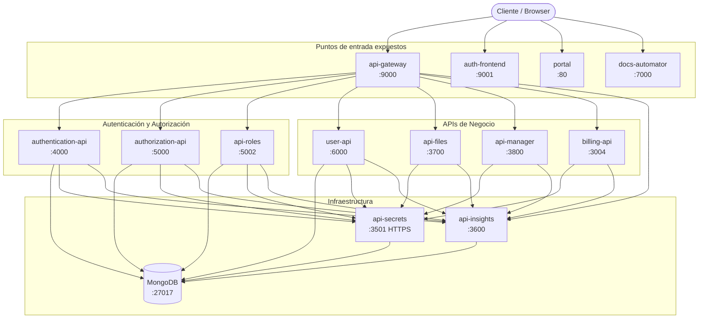

# Componentes del Ecosistema

Directorio con la ficha técnica de cada microservicio. Cada documento describe responsabilidades, endpoints, modelo de datos, dependencias y notas operativas.

---

## Mapa de componentes

---

## Tabla de componentes

| Componente | Puerto | Repositorio | Documento |
|---|---|---|---|
| API Gateway | 9000 (ext) | `dev-laoz-api-gateway` | [api-gateway.md](api-gateway.md) |
| Authentication API | 4000 (int) | `dev-laoz-authentication-api` | [authentication-api.md](authentication-api.md) |
| Authorization API | 5000 (int) | `dev-laoz-authorization-api` | [authorization-api.md](authorization-api.md) |
| API Roles | 5002 (int) | `dev-laoz-api-roles` | [api-roles.md](api-roles.md) |
| User API | 6000 (int) | `dev-laoz-api-user` | [user-api.md](user-api.md) |
| API Secrets | 3501 HTTPS (int) | `dev-laoz-api-secrets` | [api-secrets.md](api-secrets.md) |
| API Insights | 3600 (int) | `dev-laoz-api-insights` | [api-insights.md](api-insights.md) |
| API Files | 3700 (int) | `dev-laoz-api-files` | [api-files.md](api-files.md) |
| API Manager | 3800 (int) | `dev-laoz-api-manager` | [api-manager.md](api-manager.md) |
| Billing API | 3004 (int) | `dev-laoz-billing-api` | [billing-api.md](billing-api.md) |
| Auth Frontend | 9001 (ext) | `dev-laoz-auth-frontend` | [auth-frontend.md](auth-frontend.md) |
| Portal | 80 (ext) | `dev-laoz-portal` | [portal.md](portal.md) |
| Core Library | librería | `dev-laoz-config-loader` | [core-library.md](core-library.md) |

**(int)** = solo accesible internamente desde `laoz-net`  
**(ext)** = puerto expuesto al exterior
