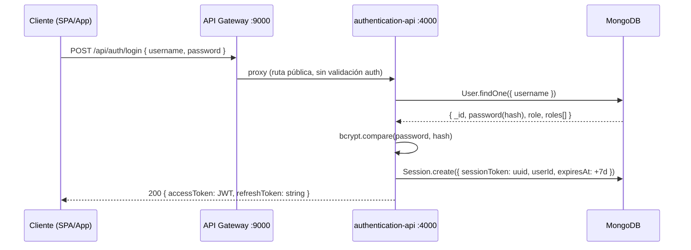
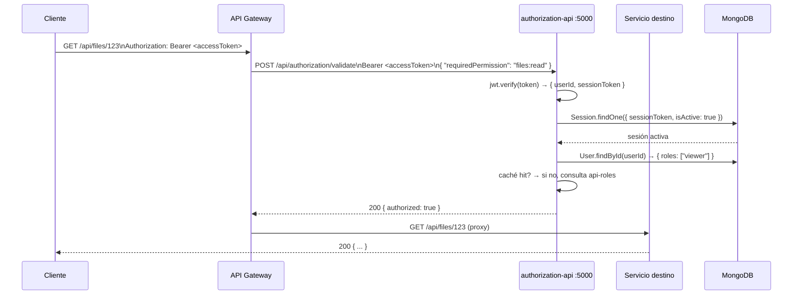
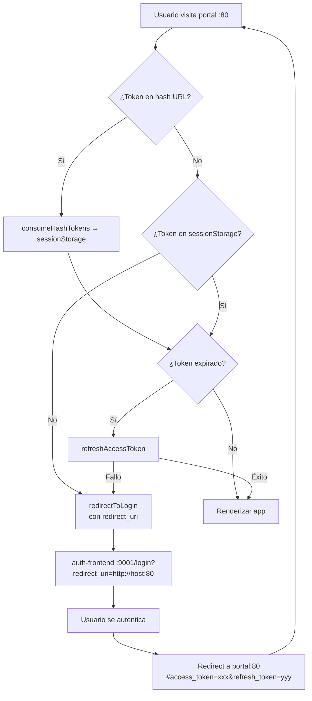

# Autenticación — Flujo JWT Completo

La autenticación del ecosistema usa **JWT stateful**: el token contiene solo identidad (`userId`, `sessionToken`); los permisos se resuelven en cada validación. Ver [ADR-001](../architecture/decisions/ADR-001-stateful-jwt.md).

---

## Tokens

| Token | Vida | Contenido | Almacenamiento recomendado (cliente) |
|---|---|---|---|
| `accessToken` | 1 hora | `{ userId, sessionToken, iat, exp }` | `sessionStorage` (SPA) |
| `refreshToken` | 7 días | opaco / referencia a sesión | `sessionStorage` o cookie HttpOnly |

---

## Flujo 1 — Login



**Request:**
```json
POST /api/auth/login
{ "username": "andres", "password": "s3cur3p@ss" }
```

**Response exitosa:**
```json
{
  "accessToken": "eyJhbGciOiJIUzI1NiIsInR5...",
  "refreshToken": "c3b4a1d2e5f6..."
}
```

**Errores posibles:**

| HTTP | Condición |
|---|---|
| 400 | `username` o `password` ausentes |
| 401 | Credenciales incorrectas |
| 403 | Usuario inactivo |
| 500 | Error de BD |

---

## Flujo 2 — Request autenticado



---

## Flujo 3 — Refresh de token

Cuando el `accessToken` expira, el cliente debe renovarlo sin re-autenticar:

```
POST /api/auth/refresh
{ "refreshToken": "c3b4a1d2e5f6..." }

→ 200 { "accessToken": "eyJhbGci..." }
```

El cliente SPA del portal implementa **silent refresh**: un timer programado 60 segundos antes de la expiración del JWT (leída del claim `exp`) ejecuta esta llamada automáticamente.

---

## Flujo 4 — Logout

```
POST /api/auth/logout
Authorization: Bearer <accessToken>

→ 200 { "message": "Sesión cerrada" }
```

El servidor marca la sesión como `isActive: false`. El token queda inválido de inmediato aunque no haya expirado.

---

## Flujo 5 — Redirección a login (SPA)

El portal (`dev-laoz-portal`) implementa un guard de autenticación:



### Protección contra open redirect
El `auth-frontend` solo acepta `redirect_uri` con el mismo `hostname` que el servidor actual. Rechaza cualquier dominio externo.

---

## Rate limiting

Aplicado globalmente por `@dev-laoz/core` (configurable con `RATE_LIMIT_MAX`). Por defecto: **100 requests por ventana**.

El endpoint `POST /api/auth/login` debería tener un rate limit adicional más estricto (implementación pendiente: `RATE_LIMIT_LOGIN_MAX`).

---

## Seguridad — Checklist

- [x] Contraseñas hasheadas con bcrypt (cost factor configurable)
- [x] JWT firmado con `JWT_SECRET` (mín. 32 chars)
- [x] Token de acceso de corta vida (1h)
- [x] Sesiones invalidables inmediatamente (logout)
- [x] `accessToken` en `sessionStorage` en el cliente SPA (no `localStorage`)
- [x] Token pasado entre apps en hash fragment (no query string — no llega al servidor)
- [x] Protección open redirect en `redirect_uri`
- [ ] Rate limiting específico para `/login` (pendiente)
- [ ] HTTPS en producción para todos los endpoints (pendiente configuración de TLS en gateway)
- [ ] Rotación de `JWT_SECRET` con soporte de múltiples claves (pendiente)
