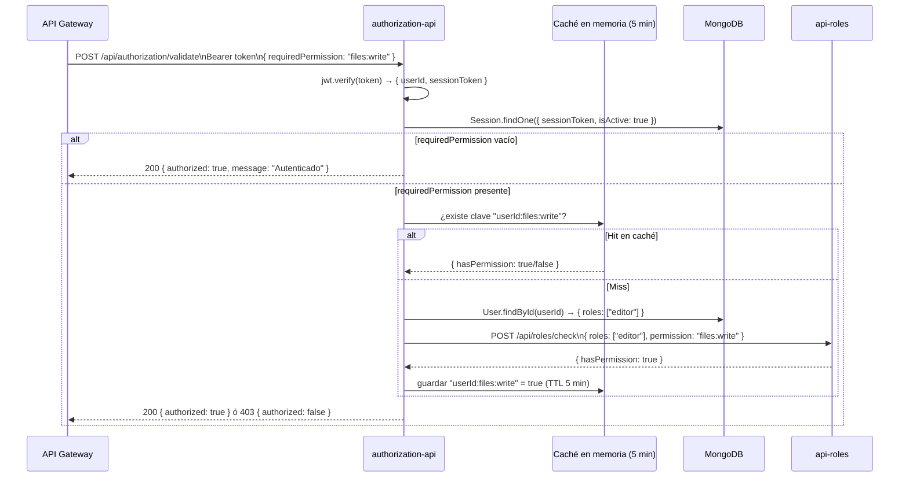

# Autorización — RBAC

El ecosistema usa **Role-Based Access Control (RBAC)** con permisos en formato `resource:action`. Ver [ADR-003](../architecture/decisions/ADR-003-rbac-roles.md).

---

## Roles del sistema

| Rol | Descripción | Permisos |
|---|---|---|
| `admin` | Acceso total | `users:*`, `roles:*`, `files:*`, `secrets:*`, `insights:*`, `billing:*` |
| `editor` | Gestión de contenido | `files:read`, `files:write`, `files:delete`, `insights:read` |
| `viewer` | Solo lectura | `files:read`, `insights:read` |
| `user` | Usuario básico | `files:read` |

Los roles personalizados se crean vía `POST /api/roles` con cualquier combinación de permisos.

---

## Formato de permisos

```
<recurso>:<acción>
```

| Recurso | Acciones disponibles |
|---|---|
| `users` | `read`, `write`, `delete`, `*` |
| `roles` | `read`, `write`, `delete`, `*` |
| `files` | `read`, `write`, `delete`, `*` |
| `secrets` | `read`, `write`, `delete`, `*` |
| `insights` | `read`, `write`, `*` |
| `billing` | `read`, `write`, `*` |

El comodín `*` es equivalente a todas las acciones definidas para ese recurso.

---

## Flujo de validación RBAC



---

## Cómo el gateway decide qué permiso requerir

El archivo `src/config/services.json` del `api-gateway` define, por ruta, el permiso requerido:

```json
{
  "routes": [
    {
      "prefix": "/api/auth",
      "target": "http://authentication-api:4000",
      "auth": false
    },
    {
      "prefix": "/api/files",
      "target": "http://api-files:3700",
      "auth": true,
      "requiredPermission": "files:read"
    },
    {
      "prefix": "/api/user",
      "target": "http://user-api:6000",
      "auth": true,
      "requiredPermission": "users:read"
    }
  ]
}
```

---

## Asignación de roles a usuarios

```http
PUT /api/user/:id
Authorization: Bearer <admin-token>
Content-Type: application/json

{
  "roles": ["editor", "viewer"]
}
```

Un usuario puede tener múltiples roles. El sistema verifica si **alguno** de los roles tiene el permiso requerido (unión).

---

## Caché de permisos

- TTL: **5 minutos** por par `userId:permission`
- Ámbito: en memoria por instancia de `authorization-api`
- Invalidación: no hay invalidación activa; los cambios de rol surten efecto en máximo 5 minutos

> En caso de necesitar invalidación inmediata (revocación de privilegios de emergencia): reiniciar `authorization-api` limpia la caché.

---

## Middleware en servicios individuales

Cada servicio puede usar `authMiddleware` de `@dev-laoz/core` para validar tokens en rutas propias (fuera del gateway):

```js
const { authMiddleware } = require('@dev-laoz/core');

// Solo verifica autenticación
router.get('/perfil', authMiddleware, handler);

// El middleware añade req.user = { userId, sessionToken } al request
```

La verificación de permiso específico se delega al gateway; el middleware interno solo verifica autenticidad del token.
