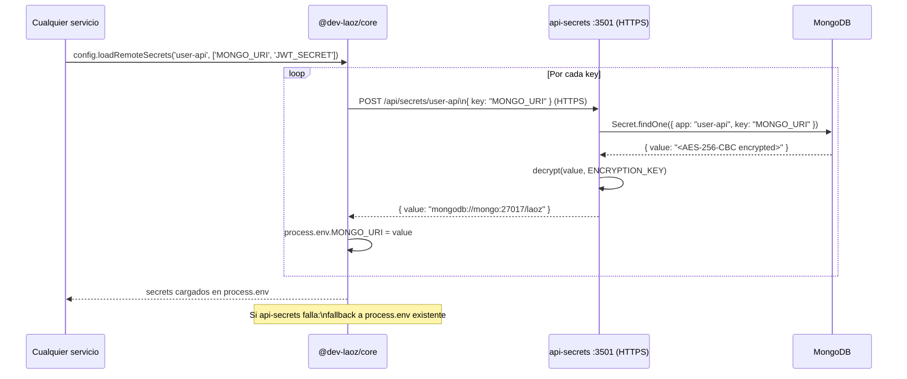

# Gestión de Secretos

Los secretos del ecosistema se almacenan cifrados en MongoDB y se sirven a través de `api-secrets`. Ver [ADR-002](../architecture/decisions/ADR-002-secrets-api.md).

---

## Flujo de carga al arranque



---

## Cifrado

- Algoritmo: **AES-256-CBC**
- Clave: `ENCRYPTION_KEY` (exactamente **32 caracteres**)
- La clave solo existe como variable de entorno de `api-secrets`; ningún otro servicio la conoce

---

## Acceso restringido por red

`api-secrets` no expone puertos en producción. Solo es accesible desde la red interna `laoz-net`. El healthcheck usa HTTPS internamente:

```yaml
healthcheck:
  test: ["CMD-SHELL", "wget -qO- --no-check-certificate https://localhost:3501/api/health || exit 1"]
```

---

## Cómo agregar un secreto nuevo

```http
POST /api/secrets
Content-Type: application/json
X-Internal-IP: <desde laoz-net>

{
  "app": "mi-servicio",
  "key": "EXTERNAL_API_KEY",
  "value": "sk-live-..."
}
```

Luego en el servicio:

```js
await config.loadRemoteSecrets('mi-servicio', ['EXTERNAL_API_KEY']);
// → process.env.EXTERNAL_API_KEY disponible
```

---

## Fallback a variables de entorno

Si `api-secrets` no está disponible (desarrollo local sin el stack completo), `@dev-laoz/core` usa el valor ya presente en `process.env`. Esto permite desarrollar servicios individuales con un `.env` local sin necesitar levantar toda la infraestructura.

**Orden de resolución:**
1. `api-secrets` (producción)
2. `process.env` existente (desarrollo / fallback)

---

## Variables de entorno de api-secrets

| Variable | Descripción |
|---|---|
| `ENCRYPTION_KEY` | Clave AES-256-CBC, **exactamente 32 caracteres** |
| `MONGO_URI` | URI de MongoDB para guardar los secretos |
| `PORT` | Puerto interno (3501) |

> Generar una `ENCRYPTION_KEY` segura: `openssl rand -base64 24 | tr -d '=+/' | head -c 32`
